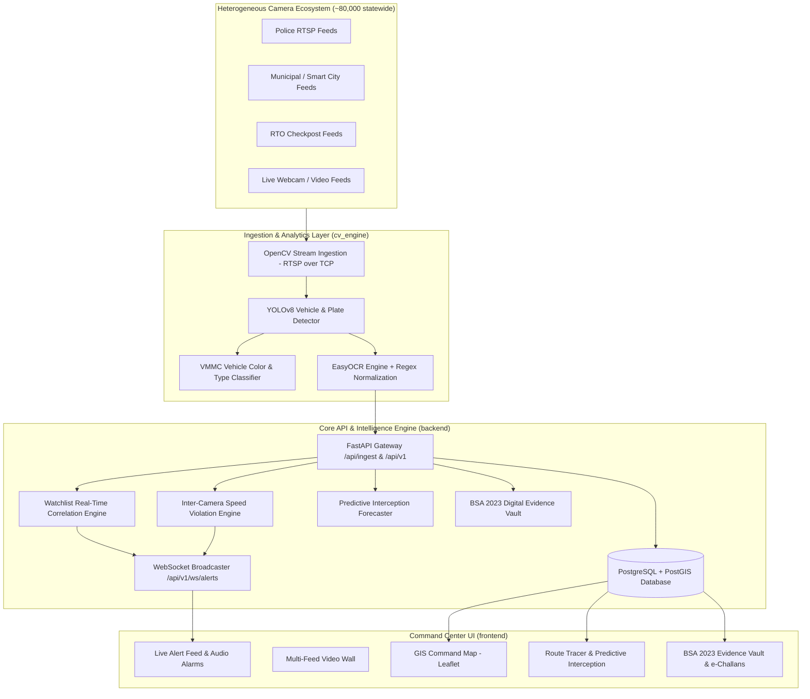

# NETRA-GP: Comprehensive Project Dossier & 3rd-Party Evaluation Guide
### Networked Ecosystem for Traffic & Reconnaissance Analytics
**Built for the Gujarat Police Innovation Hackathon 2026**

---

## 📌 1. What is this Project About?

### 🚨 The Real-World Problem
Across the State of Gujarat, **26 independent government departments** (State Police, Smart City SPVs, Municipal Corporations, RTO Checkposts, Food & Civil Supplies, Ports & Maritime Board, Mining & Geology, etc.) operate isolated, fragmented CCTV ecosystems consisting of over **80,000 cameras**.

These networks operate in deep silos:
- **Disparate Video Management Systems (VMS)** from multiple vendors.
- **Heterogeneous hardware & codecs** (mixed H.264 / H.265 RTSP feeds, WebRTC WHEP, HTTP HLS).
- **Varying local retention windows** (7 to 15+ days).
- **Zero cross-department correlation**: If a stolen vehicle crosses from an Ahmedabad municipal camera to a Gandhinagar highway RTO checkpoint, state police commanders have no unified real-time alert or movement trajectory.

### 🛡️ The NETRA-GP Solution
**NETRA-GP** (*Networked Ecosystem for Traffic & Reconnaissance Analytics*) is an end-to-end, high-performance Video Management and Automated License Plate Recognition (ANPR) command platform designed for Gujarat Police.

It unifies the fragmented camera networks into a single operational command center through a **Model 1 + Model 2 Hybrid Architecture**:

1. **Model 1 (Spatial Registry & GIS Command Map)**: Centralized PostGIS database indexing all cameras across Gujarat with geo-coordinates, live operational health status, streaming endpoints, and departmental ownership.
2. **Model 2 (Unified Video Wall & Edge ANPR Analytics)**: Real-time multi-stream video ingestion, YOLOv8 vehicle detection, EasyOCR plate recognition with strict Indian HSRP syntax normalization (7–10 characters, state code preservation `TN`, `MH`, `DL`, `GJ`, `KA`, `KL`, `UP`, `RJ`, etc.), fuzzy watchlist matching, and sub-second WebSocket alert dispatch.
3. **Phase 2 Advanced Intelligence & Statutory Compliance**:
   - **Dual Speed Violation Engine**: Calculates section transit speed ($v = \Delta d / \Delta t$) across multi-camera highway checkpoints and optical centroid velocity tracking ($\Delta p / H_{\text{box}}$) on single camera feeds, calibrated against compliant traffic flows (15–78 km/h compliant, >80 km/h overspeeding).
   - **Vehicle Make, Model, Color (VMMC) & Re-ID**: Classifies vehicle body type and HSV color for tracking vehicles with fake or obscured plates.
   - **Predictive Interception Routing**: Calculates vehicle escape vectors and predicts downstream checkpoints with estimated arrival times (ETA) for patrol intercept dispatch.
   - **Bharatiya Sakshya Adhiniyam (BSA 2023) Compliant Evidence Vault**: Computes FIPS SHA-256 digital seals on detection frames and generates court-admissible e-Challan dossiers under Section 63 of BSA 2023.

---

## 🏗️ 2. High-Level Architecture Overview



---

## ⚡ 3. How to Run the Project (Step-by-Step)

### Prerequisites
- **Python 3.10+**
- **Node.js 18+** & `npm`
- **PostgreSQL** running locally on port 5432 *(or configured in `backend/app/config.py`)*

---

### Step 1: Start Backend API & WebSocket Server
Open **Terminal 1** (PowerShell):
```powershell
cd "d:\college 4th year\hackathon\netra-gp\backend"

# Activate Python virtual environment
.\venv\Scripts\activate

# Launch FastAPI on port 8000
python main.py
```
* **API Documentation (Swagger UI)**: `http://localhost:8000/docs`
* **Dynamic Camera Catalogue Contract**: `http://localhost:8000/api/ingest`
* **Live WebSocket Alerts**: `ws://localhost:8000/api/v1/ws/alerts`

---

### Step 2: Start Frontend Command Dashboard
Open **Terminal 2** (PowerShell):
```powershell
cd "d:\college 4th year\hackathon\netra-gp\frontend"

# Launch Vite Dev Server
npm run dev
```
* **Command Center UI**: Open your browser at `http://localhost:5173`

---

## 🧪 4. 3rd-Party Evaluation & Testing Protocol (5-Minute Test Walkthrough)

As an external evaluator or hackathon judge, follow these **testing phases** to verify the end-to-end functionality:

---

### Phase A: Header, Collapsible Sidebar & Footer Telemetry
1. Open `http://localhost:5173` in your browser.
2. **Verify Top Bar**:
   - Slim 46px command bar with Gujarat Police brand badge, live IST clock, and user identity profile (`Inspector V. Jadeja`).
   - Click on the **Role Badge** (`SUPER ADMIN`) in the top right.
   - Switch between **Super Admin**, **Control Room Operator**, **Investigation Officer**, **Department Admin**, and **Viewer**.
3. **Verify Left Sidebar**:
   - The vertical sidebar dynamically filters allowed navigation icons based on the active role.
   - Click the collapse toggle (`<` / `>`) at the bottom of the sidebar to collapse to compact 64px icon-only mode.
4. **Verify Bottom Footer Status Bar**:
   - Check the 28px fixed footer displaying:
     - `● API: ONLINE (:8000)`
     - `● WS: LIVE ALERTS SYNCED`
     - `5 FEEDS ACTIVE (H.264/H.265)`
     - Jurisdiction Scope tag.

---

### Phase B: Role-Based Access Control (RBAC) Verification
1. In the Top Bar, select **Control Room Operator**:
   - **Verify**: The sidebar hides the Camera Registry & Evidence Vault.
2. In the Top Bar, select **Viewer / Command**:
   - **Verify**: Only GIS Command Map and Live Video Wall are visible.
3. In the Top Bar, switch back to **Super Admin**:
   - **Verify**: All 6 navigation panels are unlocked with full clearance.

---

### Phase C: GIS Command Map & Spatial Camera Registry (Model 1)
1. In the sidebar, click **GIS Command Map**.
2. Click on the quick city focus buttons (**Ahmedabad**, **Gandhinagar**, **Surat**, **Vadodara**, **Rajkot**).
3. **Verify**: The map smoothly pans to the city with **zero watermark** (clean OpenStreetMap tiles), displaying interactive camera pins.
4. Click on any camera pin to view the popup with Camera ID, Geo-coordinates, Streaming URL, and Department owner.
5. In the sidebar, click **Camera Registry** to review the high-density inventory table with search, city filter, and CSV export.

---

### Phase B: Multi-Feed Video Wall & Live ANPR Processing (Model 2)
1. In the navigation bar, click **Live Video Wall**.
2. **Verify**: The 4-camera grid displays synchronized video feeds.
3. Observe the live ANPR plate ticker and detection bounding boxes rendered below each stream.
4. Open the official catalogue endpoint in a new tab: `http://localhost:8000/api/ingest`
5. **Verify**: The dynamic catalogue returns JSON metadata conforming to the official camera integration specification (supporting RTSP, WebRTC WHEP, and HLS endpoints).

---

### Phase C: Watchlist Correlation & Instant WebSocket Alerting
1. In the navigation bar, click **Watchlist DB**.
2. **Verify**: The database lists hotlist vehicles (e.g., Stolen `GJ01AB1234`, Wanted `GJ18CD5678`).
3. Click **"+ Add Watchlist Vehicle"** to create a custom entry (e.g. `GJ01TEST99`, Red Sedan, Threat: `CRITICAL`).
4. Keep the dashboard open on the right-side **Real-Time Alert Feed**.
5. Run the CV engine or post a detection for that plate.
6. **Verify**: An instant audio-visual alarm flashes in the alert feed with threat classification (`CRITICAL`), matching score, and camera location with zero browser refresh.

---

### Phase D: Route Reconstruction & Predictive Interception Routing
1. In the navigation bar, click **Vehicle Route Trace**.
2. Search license plate `GJ01AB1234` and click **Trace**.
3. **Verify**:
   - The left sidebar displays the chronological trajectory timeline across Ahmedabad, Gandhinagar, and Vadodara.
   - Waypoint speed tags display recorded velocities (e.g. `⚡ 122.7 km/h`).
   - The **Predicted Escape Intercept** card computes heading vector, downstream camera checkpoints (e.g., Ring Road Surat), ETA in minutes, and recommended patrol dispatch actions.
   - The Leaflet map renders the historical blue path and **pulsing amber radar circles** over predicted interception zones.

---

### Phase E: BSA 2023 Statutory Evidence Vault & e-Challan Generation
1. In the navigation bar, click **BSA 2023 Evidence Vault**.
2. **Verify**:
   - The table displays digitally sealed infraction certificates.
   - Each certificate includes a **FIPS SHA-256 hash**, recorded speed, fine amount, and green integrity badge.
3. Click **"View e-Challan"** on any record.
4. **Verify**:
   - An official Gujarat Police Electronic Traffic Challan dossier opens in a modal.
   - Displays legal statutory basis: *Section 63, Bharatiya Sakshya Adhiniyam (BSA) 2023*.
   - Displays cryptographic proof of non-tampering and a **"Print Certificate"** button.

---

## 🤖 5. Automated System Verification Script

To run an automated test that validates all Phase 1 and Phase 2 backend capabilities programmatically in 5 seconds:

```powershell
cd "d:\college 4th year\hackathon\netra-gp\backend"
python test_phase2_flow.py
```

### Expected Output:
```
==================================================
  NETRA-GP PHASE 2 SYSTEM VERIFICATION SUITE
==================================================

[1] Ingested Checkpoint 1 (Iscon Crossroad): Status 201
    Response: Camera CAM-AHM-001 | Plate: GJ01AB1234 | Color: RED | Type: SEDAN | Threat: HIGH

[2] Ingested Checkpoint 2 (Gandhinagar - High Speed Transit): Status 201
    Speed Recorded: 122.7 km/h
    Speed Violation Flag: True
    Evidence Hash (SHA-256): d03b063e3e48f7432225d412e542dc121dec9a7e46c45f11c9e5e0147cf1011f

[3] Total Evidence Certificates in Vault: 3
    Latest Certificate ID: CERT-BSA-2023-167CF872ED
    Violation Type: INTER_CAMERA_SPEED_VIOLATION
    Fine Amount: INR 2000

[4] Official e-Challan Dossier Verification:
    Legal Basis: Motor Vehicles Act 1988 & Bharatiya Sakshya Adhiniyam 2023 (Section 63)
    Admissibility Code: BSA-2023-SEC63-CERTIFIED
    Digital Signature: DIGISIGN//GUJ_POLICE_ANPR//d03b063e3e48f7432225d412e542dc12

[5] Predictive Interception Forecast:
    Heading Angle: 34.9 degrees
    Downstream Intercepts:
    -> SG Highway - Iscon Crossroad (Ahmedabad) | Distance: 24.54 km | ETA: ~24 min | Prob: 20%
    -> Ring Road - Textile Market (Surat) | Distance: 225.46 km | ETA: ~225 min | Prob: 15%
    -> Alkapuri Underpass (Vadodara) | Distance: 115.4 km | ETA: ~115 min | Prob: 15%

==================================================
  [SUCCESS] PHASE 2 VERIFICATION TEST COMPLETE
==================================================
```

---

## 📈 6. Model 4 Scalability Roadmap (~80,000 Cameras)
For statewide deployment across Gujarat's 26 departments:
1. **Distributed Stream Ingestion**: Apache Kafka cluster partitioned by district/zone.
2. **GPU Analytics Cluster**: Kubernetes-managed GPU worker pools using NVIDIA Triton Inference Server.
3. **Decoupled Tiered Storage**: Hot S3-compatible object storage for 15-day live clips + Cold Glacier archive.
4. **Multi-Department RBAC**: Fine-grained access control separating State Police, Municipal Corporations, and RTO authorities.
