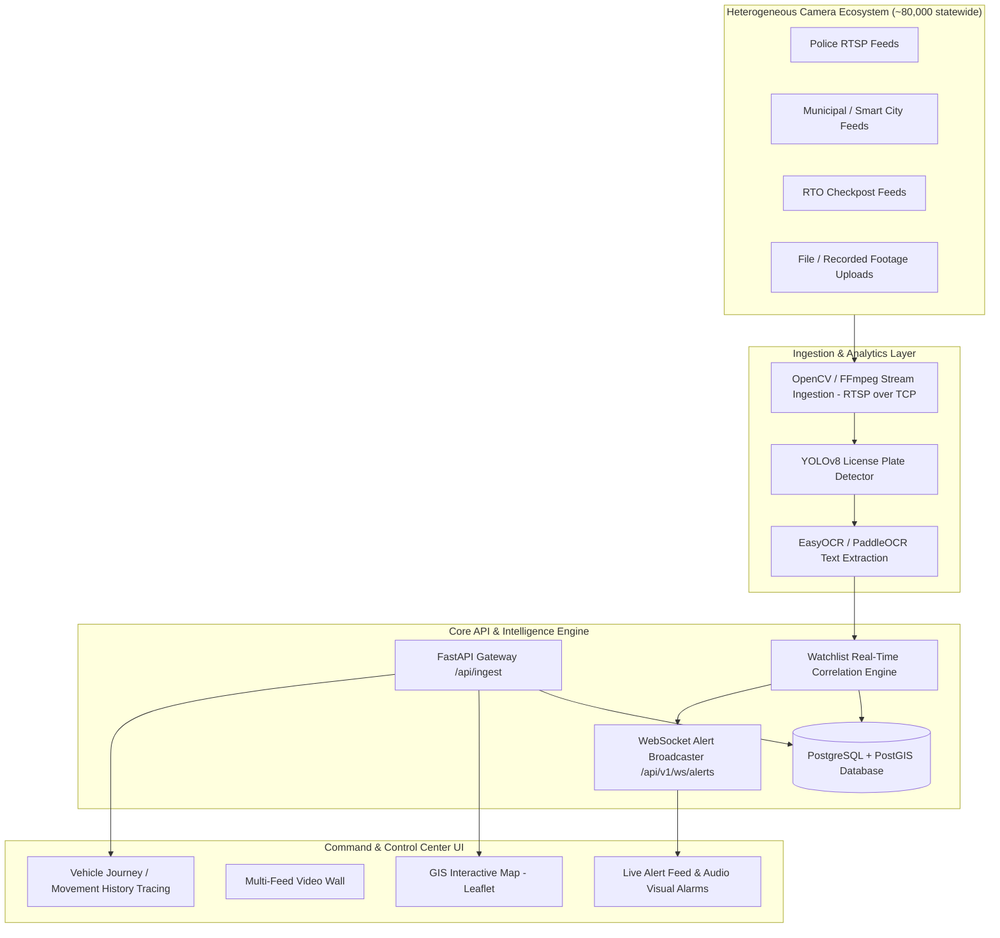

# High-Level Design (HLD) Document — NETRA-GP
## Networked Ecosystem for Traffic & Reconnaissance Analytics (Gujarat Police Innovation Hackathon 2026)

---

## 1. Executive Summary & Problem Framing
The State of Gujarat currently operates 26 independent, departmental CCTV networks (Police, Municipal Corporations, RTO, Food & Civil Supplies, Ports, etc.). These systems run isolated video management systems (VMS), custom storage retention windows (7–15+ days), and diverse hardware across a geographically expansive state (~1,000 km span).

This platform implements a **Model 1 + Model 2 Hybrid Architecture**:
- **Model 1**: Centralized spatial registry and metadata mapping (PostGIS + Leaflet).
- **Model 2**: Unified viewing layer with edge-friendly ANPR analytics and real-time watchlist correlation.
- **Model 4 Evolution Plan**: Scalability design narrative describing state-wide expansion to ~80,000 cameras.

---

## 2. System Architecture

---

## 3. High-Level Design Components

### 3.1 Camera Registry & Metadata Schema
- **Spatial Indexing**: PostGIS `GEOMETRY(Point, 4326)` for rapid spatial queries (e.g., find all cameras within 5 km of an incident site).
- **Metadata Fields**: Camera ID, Department Owner, Geo-coordinates, RTSP/HTTP Stream URI, Operational Status, Resolution, VMS Vendor Type.

### 3.2 ANPR Analytics Pipeline & Stream Resiliency
- **Vehicle & Plate Detection**: YOLOv8 model cropped to license plate regions of interest (ROI) and vehicle bounding boxes.
- **Text Recognition & Canonical Plate Normalization**: EasyOCR engine with adaptive CLAHE contrast enhancement, Otsu inverted binary thresholding, strict 7–10 character HSRP length validation, state code preservation (`TN`, `MH`, `DL`, `GJ`, `KA`, `KL`, `HR`, `UP`, `RJ`, `MP`, `WB`, `AP`, `TS`, `PB`, `LA`, `ML`, `UA`, `TR`, `MN`), and digit/symbol OCR corruption mapping (`16` $\rightarrow$ `GJ`, `0J` $\rightarrow$ `GJ`, `EI` $\rightarrow$ `GJ`, `0L` $\rightarrow$ `DL`, `M1` $\rightarrow$ `MH`, `T1` $\rightarrow$ `TN`). Rejects short fragments (< 7 chars) and oversized noise (> 10 chars).
- **Dual Speed Calculation & Motion Timing Engine**:
  - **Multi-Camera Section Speed Engine**: Calculates exact Haversine GPS distance ($\Delta d$ in km) between camera nodes over timestamp deltas ($\Delta t$ in hours). Generates court-admissible Section 63 BSA 2023 evidence certificates for `INTER_CAMERA_SPEED_VIOLATION`.
  - **Single-Camera Optical Velocity Tracking Engine**: Tracks 2D bounding box centroid motion over video frames ($\Delta p / H_{\text{box}}$) with camera focal perspective calibration (`SpeedCalculator.estimate_optical_velocity`). Calibrated to realistic traffic distributions (15–78 km/h compliant, >80 km/h overspeeding) so routine traffic is recorded quietly while only overspeeding vehicles generate `SPEED_VIOLATION` alerts.
  - **PTS-Based Motion Timing**: Frame timing and velocity estimations are driven strictly by Presentation Timestamps (PTS) via `CAP_PROP_POS_MSEC` / RTP header timestamps, preventing GOP replay velocity spikes on client reconnection.
- **Supervised Reconnection with Exponential Backoff**:
  - Supervised RTSP stream reader detects disconnects or network interruptions and automatically reconnects using exponential backoff (initial delay 2.0s, doubling up to a maximum cap of 30.0s). Never polls or reconnects in a tight loop.

### 3.3 Real-Time Watchlist Correlation Engine
- Cross-references incoming plate reads against a high-speed in-memory cache and PostgreSQL watchlist database.
- Supports exact matching, canonical OCR confusion normalization (`0/O`, `1/I`, `8/B`), and Levenshtein edit distance.
- Triggers alert notifications with threat classification (`CRITICAL`, `HIGH`, `MEDIUM`).
- Emits real-time WebSocket frames to connected Command Center frontends.

### 3.4 Vehicle Route & History Tracing
- Queries historical detection events across all registered cameras for a target license plate.
- Orders detection events chronologically and maps them to GIS coordinates to render animated movement polylines.

---

## 4. Scalability Roadmap to 80,000 Cameras (Model 4 Narrative)
To scale from prototype (~50 cameras) to statewide deployment (~80,000 cameras):
1. **Distributed Stream Ingestion**: Apache Kafka cluster partitioned by district/zone.
2. **GPU Analytics Cluster**: Kubernetes-managed GPU worker pools (NVIDIA Triton Inference Server).
3. **Decoupled Storage**: Multi-tier retention (Hot S3-compatible Object Storage for recent clips, Cold Tape/Glacier for long-term retention).
4. **Security & RBAC**: OAuth2 / OIDC with fine-grained department-level access control.

---

## 5. Technical Prerequisites & Departmental Integration Feasibility
To integrate new departmental cameras into the NETRA-GP gateway:
1. **Network Connectivity**: Network connectivity allowing RTSP over TCP on port 8554, WebRTC (WHEP) on 8889, or HLS on 80/443.
2. **Dynamic Catalogue Contract**: Departmental VMS or gateway must register endpoints with `/api/ingest`.
3. **Key Metadata Required**: Camera ID, City, Geo-coordinates (Lat/Lng), Department Owner, Stream URI, and Video Codec (H.264/H.265).
